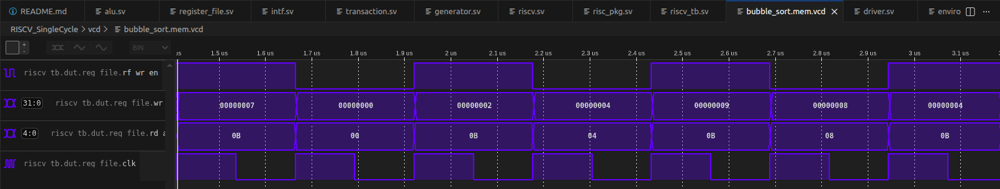
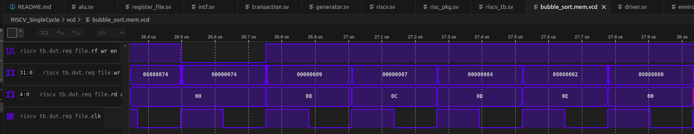
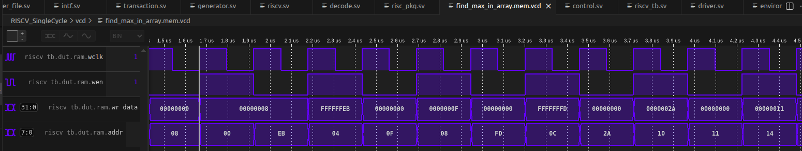
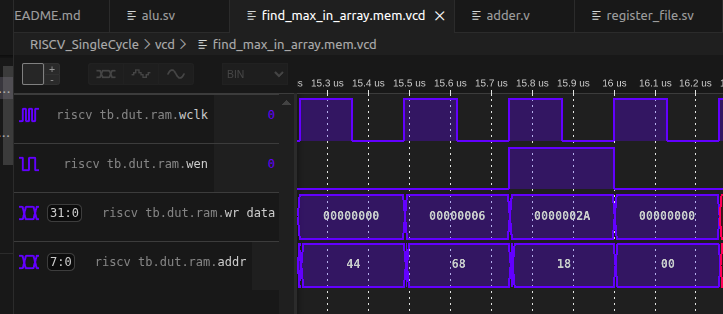

# RISCV Single Cycle implementation

- TBD: expand to 64 and 128 bits

 - `asm` folder holds the assembly programs and their hex code mem files.
 - `vcd` folder holds the simulation results.
 - `riscv_tb.sv` performs an end to end test of the following asm code blocks.

## bubble_sort.asm
See array values each rf_wr_en

See sorted values in reg_file address 0x0B through 0x0E (x11-x14)

## fibonacci_sequence.asm
See values each ram.wen in ram.wr_data

## find_max_in_array.asm
See array values each ram.wen

Wrote max value 2A to ram address 0x18:

## Design:
- Instruction memory acts as a ROM, loading asm code from a file and stores it.
Each instruction is 32 bits.

- Fetch unit reads the current instruction according to the current program counter (PC) pointer.
- Decode unit decodes the fields from the instruction bits and passes them to Control block and Register File.
- Register File is the register space of 32x registers, while x0 is the zero reg and all the rest are general purpose.
- ALU unit performs the arithmetics. The inputs to ALU are values from the x-registers or from the immediate value in the instruction. Also the PC used for jump calculations.
- Data Memory serbes as the RAM, storing and loading values.
- Branch control unit checks if the program has requested a branch jump of the PC.
- Control block is the mind which decides according to the decoded instruction, how to perform it.
- Lastly, in the high level we want to control the PC to point to the next instrucion and to control system reset.
