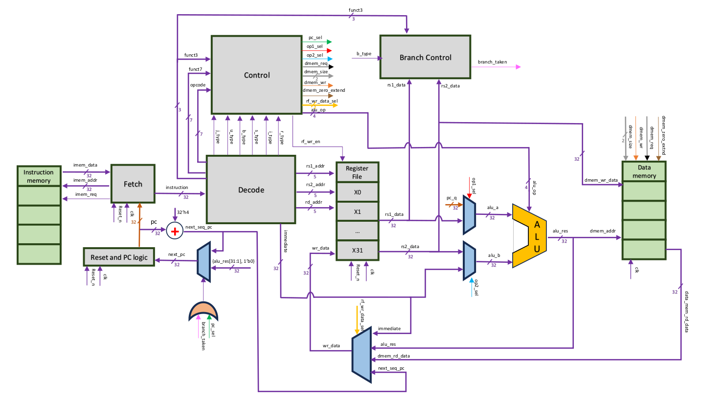
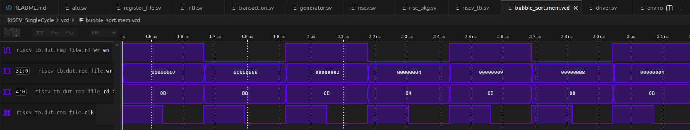
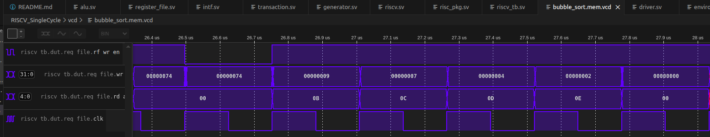
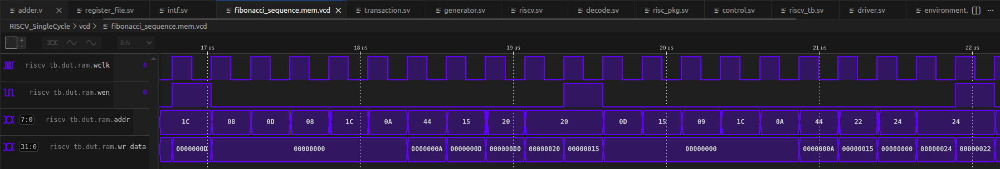

# RISCV RV32I single cycle implementation

 - `asm` folder contains assembly programs and their hex code mem files
 - `vcd` folder contains simulation results of `tb_riscv.sv`


## Architecture:



## Run:
```
src="tb_riscv.sv risc_pkg.sv riscv.sv fetch.sv decode.sv register_file.sv branch_control.sv control.sv alu.sv ../modules/memory.sv ../modules/adder.v ../modules/shift.v ../modules/mux.v"

iverilog -Wall -g2012 -I ../modules/ -o vcd/tb_riscv.vvp -s tb_riscv ${src};
vvp vcd/tb_riscv.vvp

# or:
verilator -Wno-lint --trace-vcd --binary --timing -I../modules/ --top tb_riscv --cc ${src}
./obj_dir/Vtb_riscv
```


##  Testbench files:
 - `alu.sv` unit has a **SystemVerilog** testbench in  folder
 - `memory.sv` and other small modules have testbenches in  folder
 - `riscv_tb.sv` is a Verilog application level testbench which runs the following **assembly programs**:


## bubble_sort.asm
See array values each rf_wr_en

See sorted values in reg_file address 0x0B through 0x0E (x11-x14)



## fibonacci_sequence.asm
See values each ram.wen in ram.wr_data



## find_max_in_array.asm
See array values each ram.wen

Wrote max value 2A to ram address 0x18:


## Design:
- Separate memories for instructions and data (Harvard architecture)
- Instruction memory loads asm code from a hex file and stores it. Each instruction is 32 bits.
- Fetch unit reads the current instruction according to the current program counter pointer (PC).
- Decode unit decodes the fields from the instruction bits and passes them to Control block and Register File.
- Register File is the register space of 32x registers, while x0 is the zero reg and all the rest are general purpose.
- ALU unit performs the arithmetics. The inputs to ALU are values from the x-registers or from the immediate value from the instruction. Also the PC is used for branch jump calculations.
- Data Memory serves as a RAM, storing and loading values.
- Branch control unit checks if the program has requested a branch jump of the PC.
- Control block operates all the signals for all other units according to the decoded instruction.
- Lastly, in the high level have to control the PC to point to the next instrucion and to control system reset.

This architecture performs an instruction in one clock cycle.
So the clock frequency should be calculated according to the longest data path.
The ALU unit's add operation takes 3 gate delays per bit.
The longset path commands are load and store.
So depending on the memory type the Tc should be calculated accordingly.

LW loads data from rs1+imm into rd ( `rd = M[rs1+imm]` ).
SW stores data from rs2 into rs1+imm ( `M[rs1+imm] = rs2` ).
So max full path time is:
```
LW: tC > tInstFetch(andDecode)_max + tRegFetch_max + tALU_max + tDMemRead_max + tRegWriteBackSetupTime
SW: tC > tInstFetch(andDecode)_max + tRegFetch_max + tALU_max + tDMemWriteSetupTime
```
Also should be aware of hold time violations (although not probable since tC is long enough).
The shortest path is for jal command ( `rd=pc+4; pc+=imm` ). So minimum timing is:
```
th < tInstFetch(andDecode)_min + tALU_min
```
Where th is the minimum hold time either of PC register or RegFile registers.
