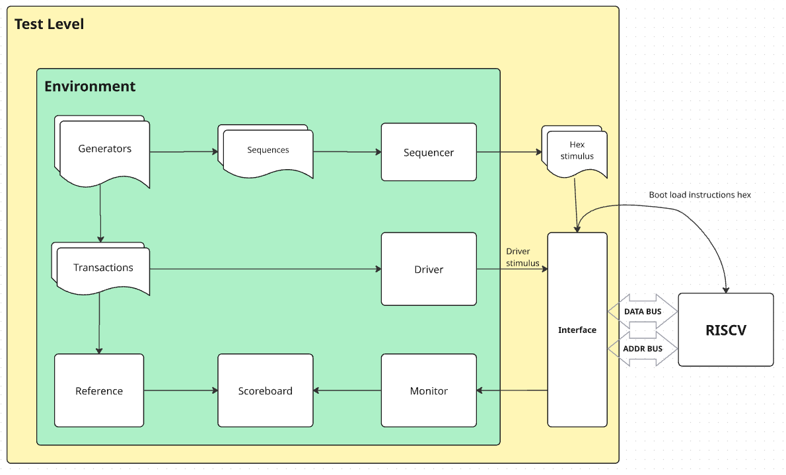
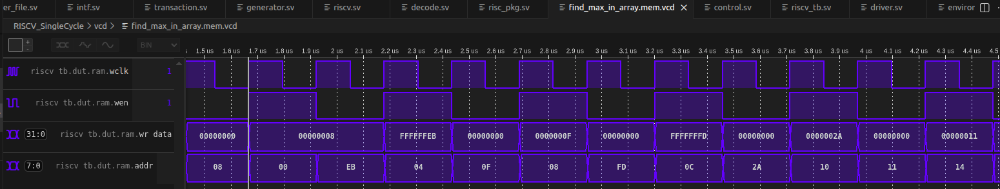
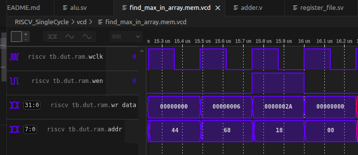

# CPP Testbench design
- Generator scenarios produce test sequences along with Driver transactions, and also the expected Reference transactions.
- Sequencer builds the instructions hex file that is boot loaded into the Instruction ROM.
- The test can generate one or multiple scenarios and hex files and then run them one by one.

## Verification plan
**Objectives:**
- Verify ISA compatibility, design functionality and signalling

**Preconditions:**
- Prefill data memory

**Strategy:**
- The whole functionality can be verified using the Store commands, which will set expected output data on the bus.
So whole verification depends on LUI and Stype commands, hence they should be tested first.

**Test plan:**
Status Done:
- Acceptance test: run commands with zero values
- Test LUI + Stype for address signals
- Test LUI + Stype for data signals
- Test Itype Load for address signals
- Test Itype Load for data signals
- Test all Itype arithmetic commands
- Test all Rtype ALU commands
- Test all Utype branch commands for positive jumps
- Test all Utype branch commands for negative jumps
- Test all Btype branch commands for no jump conditions
- Test all Btype branch commands for positive jumps
- Test all Btype branch commands for negative jumps

Status TBD:
- Additional tests... (interrupts, registers, negative)

TODO:
- RV64I: load test pattern upper bits into registers (like in Btype no jump test)

## Verification notes
-  Discovered that instructions were not fetched properly after reset. Fixed in next CI.
-  Discovered that Stype commands always returned 32 bit data, instead of requested block size. Fixed in next CI.
-  Discovered that in case the read address is outside of data memory, the Itype Load commands data was not sign extended. Fixed in next CI.
-  Issues found:
1) ALU was extending "Less Than" result to 32 bits, instead of 1 bit.
2) For RV64 immediate was not sign extended
3) For RV64 ALU result of OP-32-IMM commands was not sign extended

# Application level tests

## bubble_sort.asm
See array values each rf_wr_en

See sorted values in reg_file address 0x0B through 0x0E (x11-x14)

## fibonacci_sequence.asm
See values each ram.wen in ram.wr_data

## find_max_in_array.asm
See array values each ram.wen

Wrote max value 2A to ram address 0x18:

