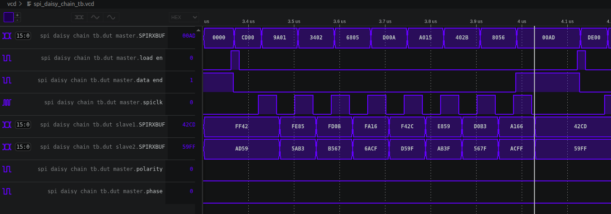
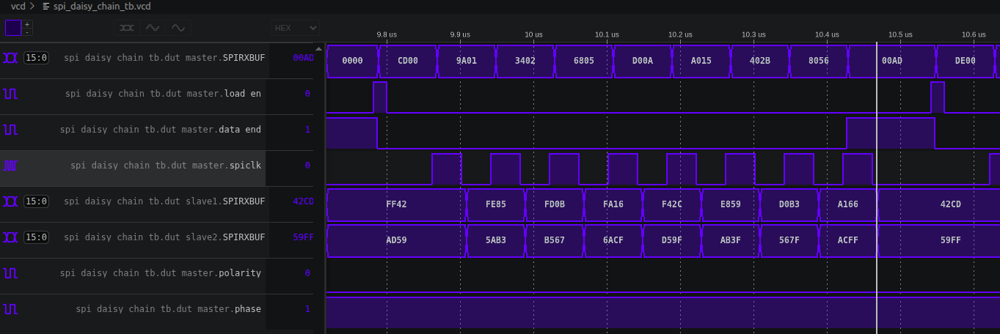
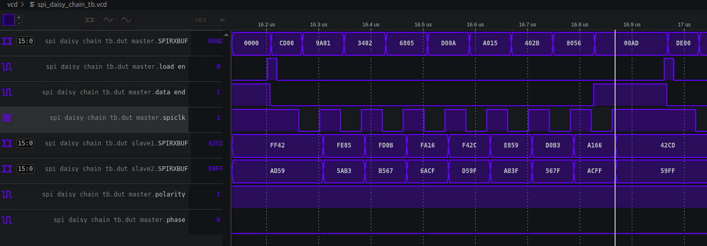
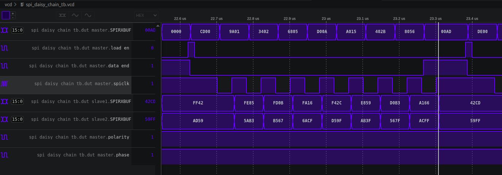

# SPI module

Spec reference: https://www.ti.com/lit/ug/sprug72/sprug72.pdf

# Simulation results

8 bit transfer via 2 slaves connected in daisy chain

## Polarity 0, phase 0:

## Polarity 0, phase 1:

## Polarity 1, phase 0:

## Polarity 1, phase 1:

