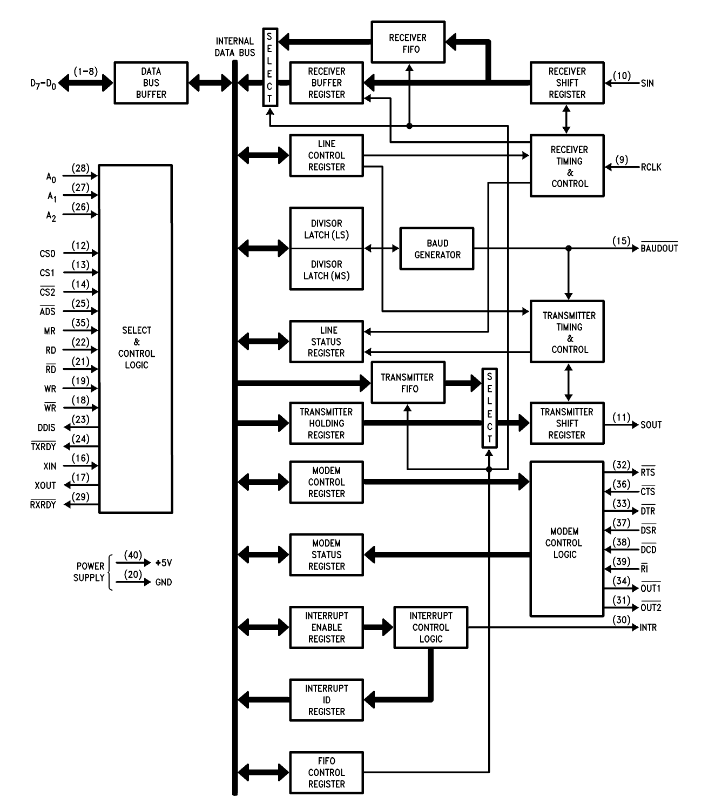
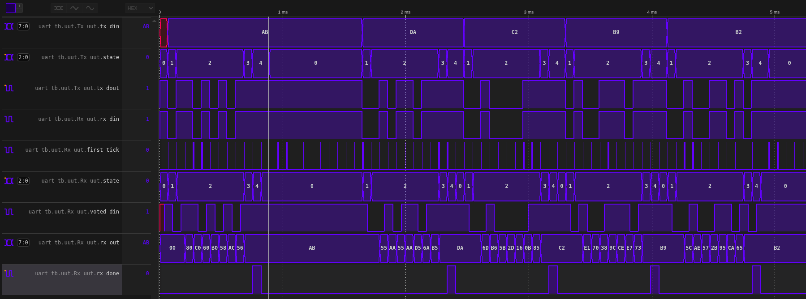

# UART module
Implementation of UART16550 according to PC16550D spec (or other TI UARTs like TL16C550)
Including a simple C++ driver which is being used in a Verilator testbench.

- Glitch suppressing and majority voting features
- Rx-Tx FIFOs
- N = 5 to 8 data bits
- M = 1, 1.5 and 2 stop bits
- OSR = oversample rate 8, 16, 32
- Some features are **TBD**: Modem, fifo threshold levels


Spec references:
- https://media.digikey.com/pdf/Data%20Sheets/Texas%20Instruments%20PDFs/PC16550D.pdf
- https://www.ti.com/lit/ds/symlink/tl16c550c.pdf


## Run C++ driver testbench:
```
make uartcpp
```

## Run Verilog testbenches:
```
make uart       # run all of the below

# specific tests:
make baud_tb
make uart_rx_tb
make uart_tx_tb
make uart_tb
make uart_top_tb
```


## Block diagram:
The modem features are not implemented for now.




## Simulation results:


uart_tb.vcd: see the input values in the tx_din signal versus the outputs in rx_out signal each tick of rx_done signal:



## Baud generator
The Baud clock is generated in `clock_divider.sv`.
This module produces an output clock based on the input clock frequency divided by a Divisor number.
For example for 100Mhz clock, for baud rate 9600bps, 16 samples per clock, with a parity bit and two stop bits (+3 bits),
set divisor to: 100 / (16 * 9600 * (8+2+1/8)) which is a rounded 470.

`DIVIDER = Freq / ((M + PAR + N)/8) × OSR × Brate)`

