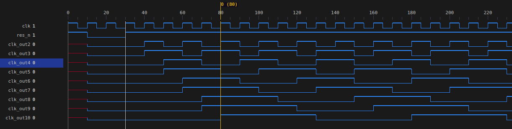

# UART module
Implementation of UART16550 according to PC16550D spec (or other TI UARTs like TL16C550)
Including a simple  which is validated in 

- Glitch suppressing and "majority voting" feature
- Rx-Tx FIFOs, which also serve as RBR and THR in non fifo mode.
- 5 to 8 data bits (N)
- 1, 1.5 and 2 stop bits (M)
- Oversample rate 8, 16, 32 (OSR)
- **Unimplemnted**: all Modem functionality, RXFIFTL error, BI error, EI error, EDSSI interrupt, DMA support


Spec references:
- https://media.digikey.com/pdf/Data%20Sheets/Texas%20Instruments%20PDFs/PC16550D.pdf
- https://www.ti.com/lit/ds/symlink/tl16c550c.pdf


## Block diagram:


## Baud generator
The Baud clock is generated in `clock_divider.sv`.
This module produces an output clock based on the input clock frequency divided by a Divisor number.
For example for 100Mhz clock, for baud rate 9600bps, 16 samples per clock, with a parity bit and two stop bits (+3 bits),
set divisor to: 100 / (16 * 9600 * (8+3+1/8)) which is a rounded 434.

`DIVIDER = Freq / ((M + PAR + N)/8) × OSR × Brate)`




# Glitch resistivity
Test result for Rx operation with 10% glitchness SUCCESSFUL


## Simulation results:


uart_tb.vcd: see the input values in the tx_din signal versus the outputs in rx_out signal each tick of rx_done signal:


## Run C driver validation:
```
make uartcpp
```

## Run testbenches:
```
make uart       # run all of the below

# specific tests:
make baud_tb
make uart_rx_tb
make uart_tx_tb
make uart_tb
make uart_top_tb
```
