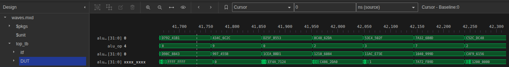

# ALU SystemVerilog testbench
This ALU is desgined according to RISCV spec.
Two Inputs of 32 bits, 4 bits input for opcode, 32 bits for result.
TODO: expand to 128 bits.


## Run with Dsim studio:
```
dvlcom -incdir ../ 'top_tb.sv'
dsim -top work.top_tb -build-all -cs-randc-max 31 +acc+b -code-cov a -waves waves.mxd

Coverage report:
dcreport -out_dir dir metrics.db
```


## Run with Verilator:
```
Compile:
verilator -Wall -Wno-UNDRIVEN -Wno-UNUSEDPARAM -Wno-IGNOREDRETURN -Wno-UNUSEDSIGNAL -Wno-WIDTHTRUNC -Wno-IMPORTSTAR -Wno-TIMESCALEMOD -Wno-DECLFILENAME -Wno-PINCONNECTEMPTY -Wno-REDEFMACRO --trace --binary --timing -I../ --top top_tb --cc adder.v shift.v mux.v ../RISCV_SingleCycle/risc_pkg.sv ../RISCV_SingleCycle/alu.sv top_tb.sv


Run the simulation:
./obj_dir/Vtop_tb
```


## Testplan:
 - Boundary values testing for verifying cyclic values of registers (for all ALU operations)
 - Stuck at 1's, stuck at 0's, crosstalk testing
 - Toggling single bits to verify each stage's FF (for all ALU operations)
 - Toggling single random bits to verify each FF (for all ALU operations)
 - Random transactions to verify functionality (for all ALU operations)
 
 ## Design:
 Testbench environment generates transactions and sends them to driver.
 Driver applies stimulus via interface to the DUT.
 The monitor passes each transaction to scoreboard.
 Scoreboard compares the received result from ALU with a Reference model ALU result.


# Results:
`waves.mxd` snapshot:
