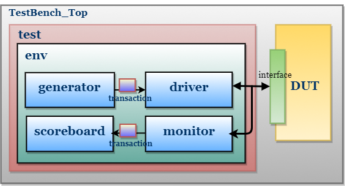
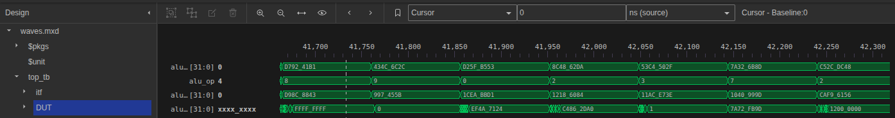

# ALU SystemVerilog testbench
Design verification of  that is used in RISCV implementation.

TODO: expand to 128 bits.

```
# run:
make alu
```

## Testbench design
 - Testbench environment generates transactions and sends them to driver.
 - Driver applies stimulus via interface to the DUT.
 - The monitor passes each transaction to scoreboard.
 - Then, scoreboard compares the received result from ALU with a Reference model ALU result.




## Testplan:
 - Boundary values testing for verifying cyclic values of registers (for all ALU operations)
 - Stuck at 1's, stuck at 0's, crosstalk testing (for all ALU operations)
 - Toggling each bit to verify each stage's FF (only for ADD operation)
 - Toggling single random bits to verify each FF (for all ALU operations except ADD)
 - Random transactions to verify functionality (for all ALU operations)
 

# Results:


`waves.mxd`
