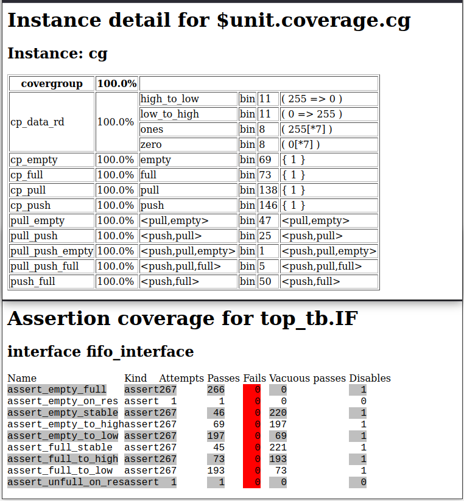
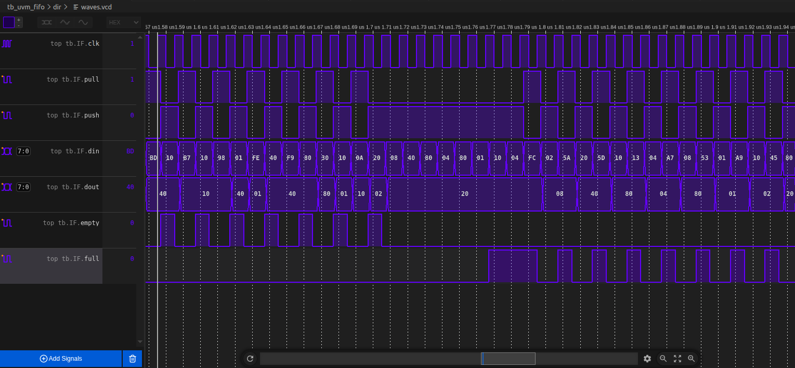

# FIFO UVM testbench

The implemented FIFO  is a synchronous type (single clock).
So TB has a single interface and a single agent enviroment with a configuration class.
Monitor broadcasts transactions to Scoreboard analysis FIFO export
and also to Coverage Collector's analysis export.


Run via Dsim studio (Compile -> Elab -> Sim): 

Process coverage metrics:
```
dcreport -out_dir dir metrics.db
```

## Test plan:
 - Boundary values transactions for data memory lines
 - Consecutive single push + pull while only one bit of data in is set
 - Push until full then pull until empty
 - Random push and pull (including parallel push+pull)
 

## Results:





`./dir/waves.mxd:`

