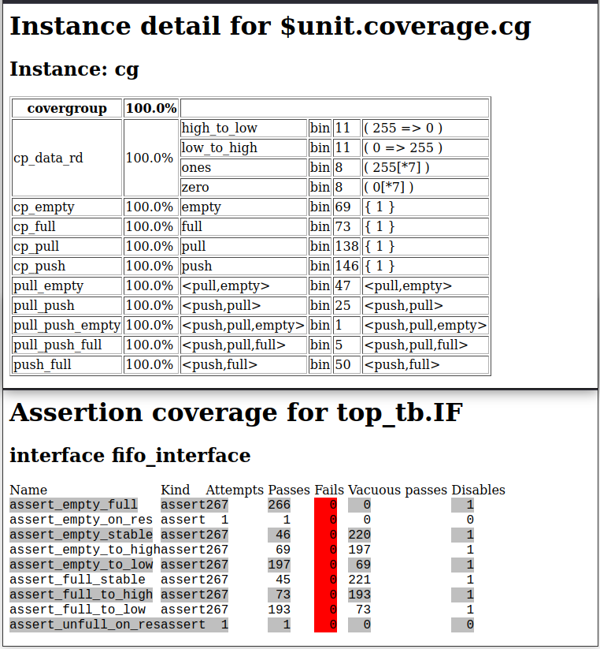
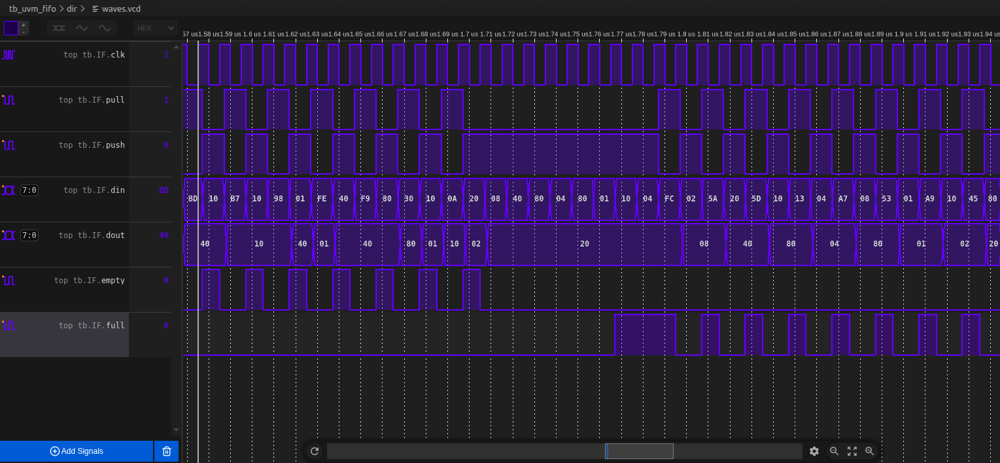

# FIFO UVM testbench

The implemented  module is of a synchronous type (single clock).
So TB has a single interface and a single agent enviroment with a configuration class.
Monitor broadcasts transactions to Scoreboard analysis FIFO export port
and also to Coverage collector's analysis export port.
Scoreboard uses a queue as a Ref model.

# UVM testbench design:


Run via Dsim studio (Compile -> Elab -> Sim): 

Process coverage metrics:
```
dcreport -out_dir dir metrics.db
```


## Test plan:
 - Strategy: logic is verified using a ref model in the scoreboard and additionaly with  and 
 - Regression  runs all tests using `uvm_sequence_library`
 - Tests:
    - Push 0x00 until full, pull until empty
    - Push 0xFF until full, pull until empty

    - Negative: push when full  (done in each of the above)
    - Negative: pull when empty (done in each of the above)

    - Consecutive single push then pull pairs after empty was set having data_in with only 1 bit set (repeat for all data bits)
    - Consecutive single push then pull pairs after full  was set having data_in with only 1 bit set (repeat for all data bits)

    - Push and pull in parallel while full,  data_in alternates with 0x00 and 0xFF
    - Push and pull in parallel while empty, data_in alternates with 0x00 and 0xFF

    - Randomized transactions test


## Results:





