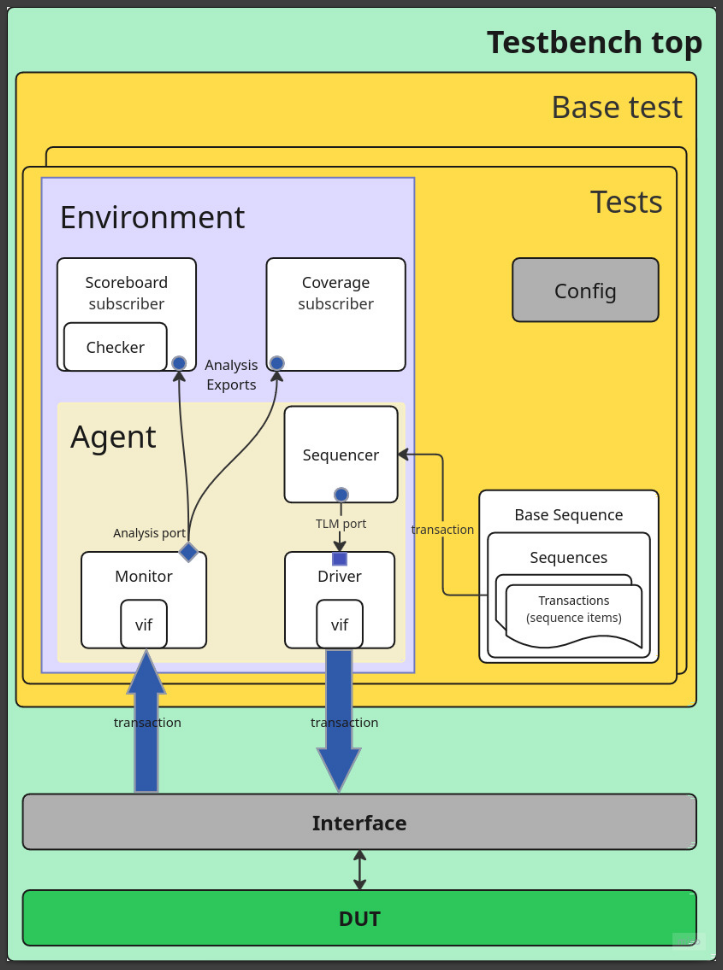

# Memory UVM testbench
The DUT is a one port  which is used in RISCV implementation.
The testbench is designed so that it would be possible to verify different bus widths.
In the deployment actions can view this test suite run over **8 to 128** bits busses.

## Test plan

- Stuck bits verification: Consequent write and read back-to-back operations with alternating data bits for all addresses

- Address/Coupling Faults: write in opposite direction of addresses with different block sizes

- Stress pattern test: Write 0x55 and 0xAA to same address then read

- Functionality: Random transactions

- Negative: Read/Write invalid addresses

- Init test: Boot load hex file and read whole memmory

## Design
UVM design with one agent, scoreboard and coverage collector.
The scoreboard uses a two-dimension array variable as a memory Reference model.
The memory has two types - sync and async read operation.
Also has two modes of endianess.
These modes are tested and can be modified in 

