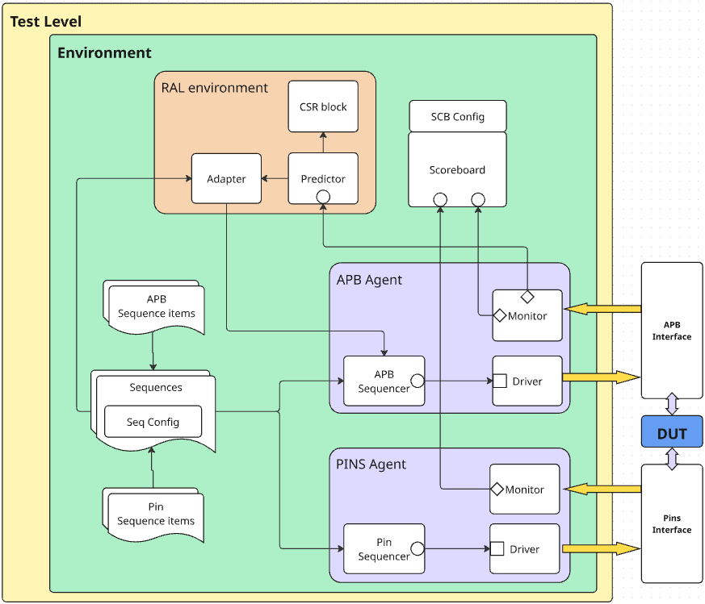

# Test Plan (High level)
- Common actions: reset in the end of each test and verify default CSR values and PIN outputs
- Strategy: All write and read tests should be done for all modes of WordLen, StopBits, Parity

- CSR verification:
  - Write+read all registers in Dlab mode
  - Write+read all registers in non-Dlab mode
- Baud verification:
  - Different divisor values
  - Reset after set
- Fifo disabled, interrupts disabled:
  - Send byte by byte
  - Data Override cases
  - Recieve invalid parity bit
  - Recieve invalid stop bit
- Fifo enabled, interrupts disabled:
  - Send byte by byte
  - Send strings
  - Data Override cases
  - Recieve invalid parity bits
  - Recieve invalid stop bits

TODO:
- Fifo disabled, interrupts enabled:
  - Trigger all interrupts
- Fifo enabled, interrupts enabled:
  - Trigger all interrupts
- Glitched Rx bits test

# Design
UVM structure:
- RAL model to handle CSR verifications
- Two agents for APB interface and external Pins interface
- Additional sequencer to drive pins stimulus
- Single scoarboard checks samples from APB and from external Pins
- Sequence library runs all tests

