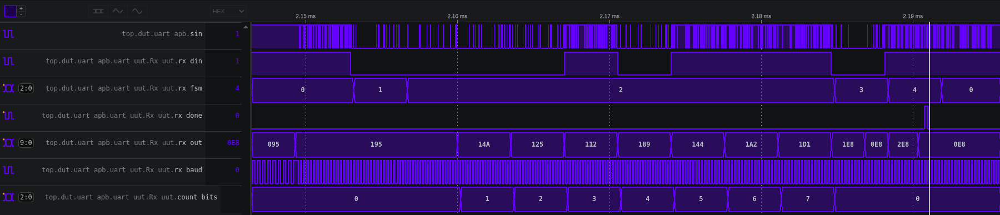

# UVM design structure

- RAL model to handle CSR verifications
- Two agents for APB interface and external Pins interface
- APB driver by default is driving without SETUP phase, as it adds an additional cycle, which will hide critical issues
- Additional sequencer to drive pins stimulus
- Single scoarboard checks samples from APB and from external Pins
- Sequence library runs all tests

# Test Plan (High level)
- Common actions: reset in the end of each test and verify default CSR values and PIN outputs
- Strategy:
  - All tests should be done for all modes of WordLen, StopBits, Parity
  - Differeent order of actions should be veirifed, i.e read IIR before and after LSR, read RBR before and after read LSR, etc...

- CSR verification:
  - Write+read all registers in Dlab mode
  - Write+read all registers in non-Dlab mode

- Baud verification:
  - Different divisor values
  - Reset after set

- Fifo disabled, interrupts disabled:
  - Send byte by byte
  - Data Override cases
  - Recieve invalid parity bit
  - Recieve invalid stop bit

- Fifo enabled, interrupts disabled:
  - Send byte by byte
  - Send strings
  - Data Override cases
  - Recieve invalid parity bits
  - Recieve invalid stop bits

Interrupt tests:
- Fifo disabled, interrupts enabled:
  - Trigger each one of the interrupts
  - Trigger all of the interrupts
- Fifo enabled, interrupts enabled:
  - Trigger each one of the interrupts
  - Trigger all of the interrupts

Special cases:
- Glitched Rx bits test
- Consecutive errors of same type
- Read LSR after pulling the last byte (instead of reading before)

TODO:
- Connect external uart module

# Glitch test
Test result for Rx operation with 10% glitchness SUCCESSFUL

